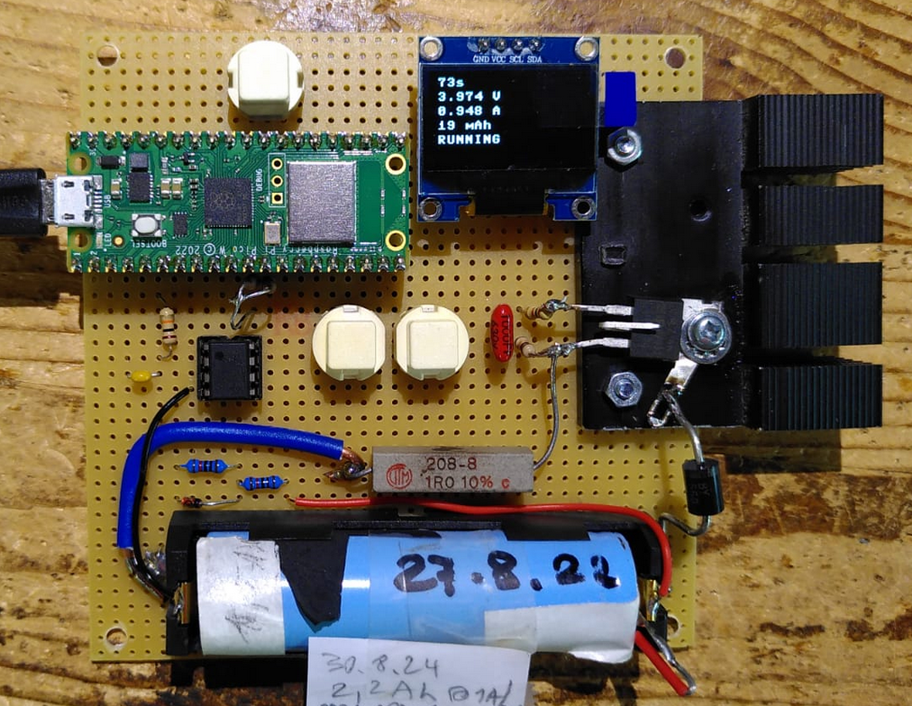

# LiIon Capacity Meter
Measure the remaining capacity of recycled 18650 cells

I have collected a lot of 18650 cells that I want to use for new projects.
To do this, measuring the remaining capacity is essential.

It seems trivial to do this, but there are some things to care about, especially the need for good low ohm connections to the battery.
I use a Kelvin connection (4 wire connection) to be sure that I measure the battery voltage and not some voltage including voltage drops on conductors. Even at 1A only these can lead to unreproducible results.

The project uses a Raspi Pico and a constant current sink (1A) that is switched off at a threshold voltage (3V).

